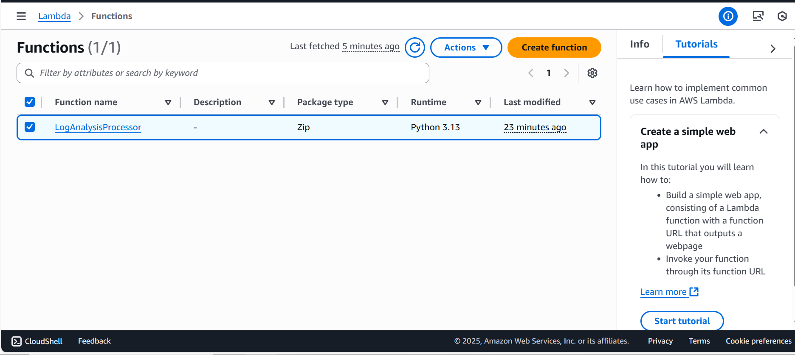
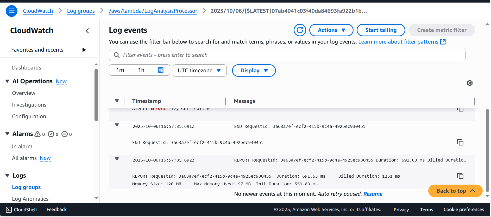
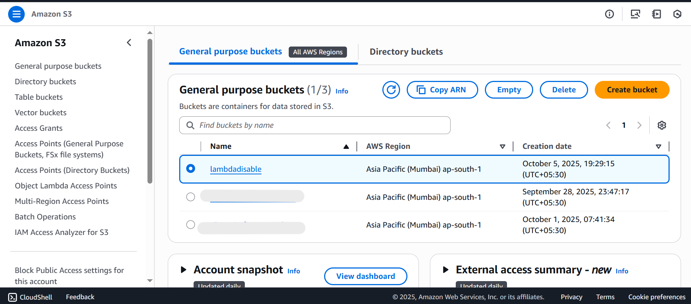
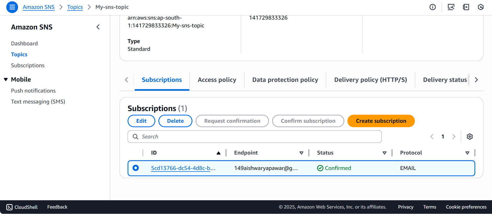
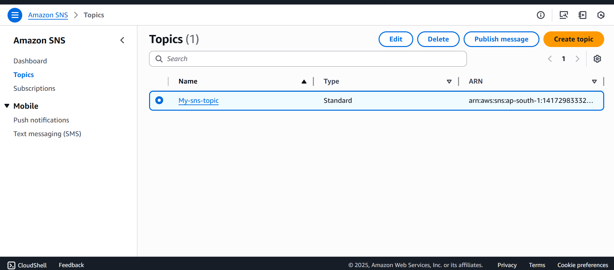
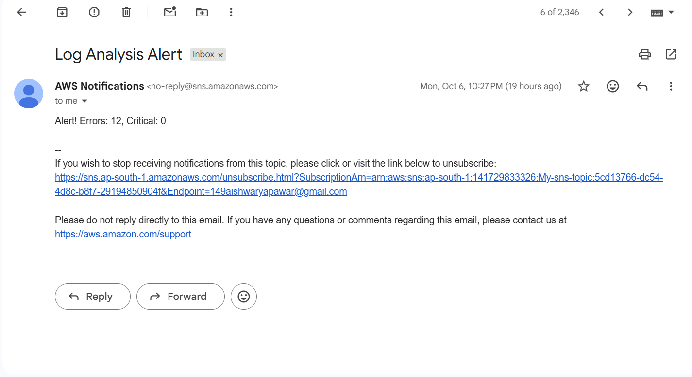

#  AWS Lambda-Based Real-Time Log Analysis System

A complete **Serverless Log Monitoring Solution** built using **AWS Lambda, DynamoDB, CloudWatch, SNS, and S3**. This project automatically processes CloudWatch logs, detects errors and warnings, stores structured data in DynamoDB, and sends email alerts for critical issues — all without managing any servers.

---

##  Architecture Diagram

```text
        +-------------------------+
        |     CloudWatch Logs     |
        | (/aws/lambda/test-app)  |
        +-----------+-------------+
                    |
                    | (Event Trigger)
                    v
           +-------------------+
           |   AWS Lambda      |
           | (Log Processor)   |
           +---------+---------+
                     |
        +------------+------------+
        | DynamoDB Tables         |
        |  - LogAnalysis          |
        |  - LogMetrics           |
        |  - LogAlerts            |
        +------------+------------+
                     |
                     v
           +-------------------+
           | Amazon SNS (Email)|
           | Alert Notifications|
           +-------------------+
                     |
                     v
           +-------------------+
           | Amazon S3 (Archive)|
           | Store old logs     |
           +-------------------+
```

---

##  Project Screenshots

### 1. CloudWatch Log Groups

*Log processor Lambda function with Python 3.13 code*

### 5. Lambda Function List

*LogAnalysisProcessor function successfully deployed*

### 6. Lambda Execution Logs

*CloudWatch logs showing successful log processing and storage*

### 7. S3 Bucket for Archive

*lambdadisable bucket in Mumbai region for long-term log storage*

### 8. SNS Topic Subscription

*Email subscription confirmed for receiving alerts*

### 9. SNS Topics Overview

*My-sns-topic created for alert notifications*

### 10. EMAIL Alert Recieved

*Email Recieved when limit reached*

---

##  Features

- ✅ **Real-time Log Processing** - Automatically processes logs as they arrive
- ✅ **Intelligent Classification** - Detects ERROR, WARNING, CRITICAL, and INFO logs
- ✅ **Email Alerts** - Sends notifications for critical issues via SNS
- ✅ **Data Storage** - Stores processed logs in DynamoDB for analysis
- ✅ **Metrics Tracking** - Aggregates statistics every 5 minutes
- ✅ **Log Archival** - Archives logs to S3 for long-term storage
- ✅ **Serverless Architecture** - No server management, pay only for what you use
- ✅ **Scalable** - Automatically scales with log volume

---

##  Tech Stack

- **AWS Lambda** - Serverless compute for log processing
- **Amazon DynamoDB** - NoSQL database for storing logs and metrics
- **Amazon CloudWatch** - Log ingestion and monitoring
- **Amazon SNS** - Email notification service
- **Amazon S3** - Object storage for log archival
- **Python 3.13** - Programming language for Lambda function
- **IAM** - Identity and access management

---

##  Prerequisites

Before you begin, ensure you have:

- AWS Account (Free Tier eligible)
- AWS Console access
- Basic understanding of AWS services
- Email address for receiving alerts

---

##  Step-by-Step Setup Guide

### STEP 1: AWS Account Setup

1. Login to [AWS Console](https://aws.amazon.com/console/)
2. Select Region: `ap-south-1 (Mumbai)` from top-right dropdown
3. Ensure you're using root user or IAM user with admin privileges

**Checkpoint:** ✅ AWS Console open with correct region selected

---

### STEP 2: Create DynamoDB Tables

Create three tables with the following specifications:

#### Table 1: LogAnalysis
- **Table name:** `LogAnalysis`
- **Partition key:** `log_id` (String)
- **Sort key:** `timestamp` (Number)
- **Capacity mode:** On-demand

#### Table 2: LogMetrics
- **Table name:** `LogMetrics`
- **Partition key:** `metric_id` (String)
- **Sort key:** `timestamp` (Number)
- **Capacity mode:** On-demand

#### Table 3: LogAlerts
- **Table name:** `LogAlerts`
- **Partition key:** `alert_id` (String)
- **Sort key:** `timestamp` (Number)
- **Capacity mode:** On-demand

**Steps:**
1. Go to DynamoDB console
2. Click "Create table"
3. Fill in the details for each table
4. Select "On-demand" capacity mode
5. Click "Create table"

**Checkpoint:** ✅ Three tables created and in "Active" status

---

### STEP 3: Create S3 Bucket

1. Go to S3 console
2. Click "Create bucket"
3. **Bucket name:** `lambdadisable` (or choose your unique name)
4. **Region:** ap-south-1
5. **Block Public Access:** Keep all checkboxes enabled (recommended)
6. **Encryption:** Enable default encryption
7. Click "Create bucket"

**Checkpoint:** ✅ S3 bucket created successfully

---

### STEP 4: Setup SNS Topic for Alerts

1. Go to SNS console
2. Click "Create topic"
3. **Type:** Standard
4. **Name:** `My-sns-topic`
5. Click "Create topic"
6. Click "Create subscription"
7. **Protocol:** Email
8. **Endpoint:** Your email address
9. Click "Create subscription"
10. **IMPORTANT:** Check your email and click "Confirm subscription"

**Checkpoint:** ✅ SNS topic created and email subscription confirmed

**Save your SNS ARN:** `arn:aws:sns:ap-south-1:141729833326:My-sns-topic`

---

### STEP 5: Create Lambda Function

1. Go to Lambda console
2. Click "Create function"
3. Select "Author from scratch"
4. **Function name:** `LogAnalysisProcessor`
5. **Runtime:** Python 3.11 (or later)
6. **Architecture:** x86_64
7. **Permissions:** Create a new role with basic Lambda permissions
8. Click "Create function"

**Checkpoint:** ✅ Lambda function created

---

### STEP 6: Add Lambda Code

1. In Lambda function page, scroll to "Code source" section
2. Delete existing code
3. Paste the following code:

```python
import json
import boto3
import gzip
import base64
import re
from datetime import datetime
from decimal import Decimal
import os

dynamodb = boto3.resource('dynamodb')
sns = boto3.client('sns')
s3 = boto3.client('s3')

LOGS_TABLE = os.environ.get('LOGS_TABLE', 'LogAnalysis')
METRICS_TABLE = os.environ.get('METRICS_TABLE', 'LogMetrics')
ALERTS_TABLE = os.environ.get('ALERTS_TABLE', 'LogAlerts')
SNS_TOPIC_ARN = os.environ.get('SNS_TOPIC_ARN', 'arn:aws:sns:ap-south-1:141729833326:My-sns-topic')
S3_BUCKET = os.environ.get('S3_BUCKET', 'lambdadisable')

LOG_PATTERNS = {
    'ERROR': re.compile(r'\b(error|exception|failed|failure)\b', re.IGNORECASE),
    'WARNING': re.compile(r'\b(warning|warn|deprecated)\b', re.IGNORECASE),
    'CRITICAL': re.compile(r'\b(critical|fatal|panic|emergency)\b', re.IGNORECASE),
    'INFO': re.compile(r'\b(info|information|success)\b', re.IGNORECASE)
}

IP_PATTERN = re.compile(r'\b(?:\d{1,3}\.){3}\d{1,3}\b')
STATUS_CODE_PATTERN = re.compile(r'\b(status|code)[:\s]+(\d{3})\b', re.IGNORECASE)

def lambda_handler(event, context):
    try:
        compressed_payload = base64.b64decode(event['awslogs']['data'])
        uncompressed_payload = gzip.decompress(compressed_payload)
        log_data = json.loads(uncompressed_payload)
        
        print(f"Processing {len(log_data['logEvents'])} log events")
        
        processed_logs = []
        metrics = {'total': 0, 'error': 0, 'warning': 0, 'critical': 0, 'info': 0}
        
        for log_event in log_data['logEvents']:
            processed_log = process_log_event(log_event, log_data)
            processed_logs.append(processed_log)
            
            metrics['total'] += 1
            severity = processed_log.get('severity', 'INFO').lower()
            if severity in metrics:
                metrics[severity] += 1
        
        store_logs(processed_logs)
        update_metrics(metrics, log_data['logGroup'])
        check_alerts(processed_logs, metrics)
        
        return {
            'statusCode': 200,
            'body': json.dumps({'message': 'Success', 'processed': len(processed_logs)})
        }
    except Exception as e:
        print(f"Error: {str(e)}")
        raise

def process_log_event(log_event, log_data):
    message = log_event['message']
    timestamp = log_event['timestamp']
    severity = determine_severity(message)
    
    return {
        'log_id': f"{log_event['id']}_{timestamp}",
        'timestamp': timestamp,
        'datetime': datetime.fromtimestamp(timestamp / 1000).isoformat(),
        'log_group': log_data['logGroup'],
        'log_stream': log_data['logStream'],
        'message': message,
        'severity': severity
    }

def determine_severity(message):
    for severity, pattern in LOG_PATTERNS.items():
        if pattern.search(message):
            return severity
    return 'INFO'

def store_logs(logs):
    table = dynamodb.Table(LOGS_TABLE)
    with table.batch_writer() as batch:
        for log in logs:
            batch.put_item(Item=log)
    print(f"Stored {len(logs)} logs")

def update_metrics(metrics, log_group):
    table = dynamodb.Table(METRICS_TABLE)
    timestamp = int(datetime.now().timestamp())
    interval_timestamp = timestamp - (timestamp % 300)
    
    metric_item = {
        'metric_id': f"{log_group}_{interval_timestamp}",
        'log_group': log_group,
        'timestamp': interval_timestamp,
        'total_logs': metrics['total'],
        'error_count': metrics['error'],
        'warning_count': metrics['warning'],
        'critical_count': metrics['critical']
    }
    table.put_item(Item=metric_item)

def check_alerts(logs, metrics):
    if metrics['error'] > 10 or metrics['critical'] > 0:
        alert_message = f"Alert! Errors: {metrics['error']}, Critical: {metrics['critical']}"
        print(alert_message)
        
        if SNS_TOPIC_ARN:
            sns.publish(
                TopicArn=SNS_TOPIC_ARN,
                Subject="Log Analysis Alert",
                Message=alert_message
            )
        
        table = dynamodb.Table(ALERTS_TABLE)
        table.put_item(Item={
            'alert_id': f"alert_{int(datetime.now().timestamp())}",
            'timestamp': int(datetime.now().timestamp()),
            'message': alert_message,
            'severity': 'CRITICAL' if metrics['critical'] > 0 else 'WARNING'
        })
```

4. Click "Deploy"

#### Configure Environment Variables

1. Go to "Configuration" tab → "Environment variables"
2. Click "Edit" → "Add environment variable"
3. Add these 5 variables:

| Key | Value |
|-----|-------|
| `LOGS_TABLE` | `LogAnalysis` |
| `METRICS_TABLE` | `LogMetrics` |
| `ALERTS_TABLE` | `LogAlerts` |
| `SNS_TOPIC_ARN` | `arn:aws:sns:ap-south-1:141729833326:My-sns-topic` |
| `S3_BUCKET` | `lambdadisable` |

4. Click "Save"

#### Configure Timeout and Memory

1. Go to "Configuration" tab → "General configuration"
2. Click "Edit"
3. **Timeout:** 1 min 0 sec
4. **Memory:** 512 MB
5. Click "Save"

**Checkpoint:** ✅ Code deployed, environment variables set, timeout configured

---

### STEP 7: Add IAM Permissions

1. Go to "Configuration" tab → "Permissions"
2. Click on the execution role name (opens IAM console)
3. Click "Add permissions" → "Attach policies"
4. Search and select these policies:
   - ✅ `AmazonDynamoDBFullAccess`
   - ✅ `AmazonS3FullAccess`
   - ✅ `AmazonSNSFullAccess`
5. Click "Add permissions"

**Checkpoint:** ✅ Lambda has permissions to access DynamoDB, S3, and SNS

---

### STEP 8: Setup CloudWatch Log Group

1. Go to CloudWatch console
2. Click "Log groups" in left sidebar
3. Click "Create log group"
4. **Log group name:** `/aws/lambda/test-app`
5. **Retention:** 1 week
6. Click "Create"

#### Create Subscription Filter

1. Click on the log group `/aws/lambda/test-app`
2. Go to "Subscription filters" tab
3. Click "Create" → "Lambda subscription filter"
4. **Lambda function:** Select `LogAnalysisProcessor`
5. **Log format:** Other
6. **Subscription filter name:** `LogProcessorFilter`
7. **Filter pattern:** Leave empty (processes all logs)
8. Click "Start streaming"
9. Click "OK" on permission popup

**Checkpoint:** ✅ Log group created and connected to Lambda

---

### STEP 9: Testing the System

#### Generate Test Logs Using CloudShell

1. Open CloudShell (icon in top-right or bottom-left of console)
2. Wait for CloudShell to initialize (30 seconds)

#### Create Log Stream

```bash
aws logs create-log-stream \
  --log-group-name /aws/lambda/test-app \
  --log-stream-name test-stream-1 \
  --region ap-south-1
```

#### Generate Sample Logs

```bash
# INFO log
aws logs put-log-events \
  --log-group-name /aws/lambda/test-app \
  --log-stream-name test-stream-1 \
  --log-events timestamp=$(date +%s000),message="User login successful - user_id: user123 from IP 192.168.1.100" \
  --region ap-south-1

# ERROR log
aws logs put-log-events \
  --log-group-name /aws/lambda/test-app \
  --log-stream-name test-stream-1 \
  --log-events timestamp=$(date +%s000),message="Database connection error - failed to connect to MySQL server" \
  --region ap-south-1

# ERROR log
aws logs put-log-events \
  --log-group-name /aws/lambda/test-app \
  --log-stream-name test-stream-1 \
  --log-events timestamp=$(date +%s000),message="API request failed with status code 500 - Internal server error" \
  --region ap-south-1

# CRITICAL log
aws logs put-log-events \
  --log-group-name /aws/lambda/test-app \
  --log-stream-name test-stream-1 \
  --log-events timestamp=$(date +%s000),message="Critical system failure - disk space full on /var/log" \
  --region ap-south-1

# WARNING log
aws logs put-log-events \
  --log-group-name /aws/lambda/test-app \
  --log-stream-name test-stream-1 \
  --log-events timestamp=$(date +%s000),message="High memory usage warning - 85 percent memory utilized" \
  --region ap-south-1
```

---

## ✅ Verification Steps

### 1. Check Lambda Execution

1. Go to Lambda → LogAnalysisProcessor
2. Click "Monitor" tab → "View CloudWatch logs"
3. Click latest log stream
4. You should see: `Processing 5 log events` and `Stored 5 logs`

### 2. Verify DynamoDB Data

#### LogAnalysis Table
1. Go to DynamoDB → Tables → LogAnalysis
2. Click "Explore table items"
3. You should see 5 log entries with different severities

#### LogMetrics Table
1. Go to DynamoDB → Tables → LogMetrics
2. Click "Explore table items"
3. You should see metric entries with counts

### 3. Check Email Alerts

- If critical logs were generated, check your email inbox
- Subject: "Log Analysis Alert"
- Contains error and critical counts

---

##  Project Structure

```
log-analysis-system/
├── README.md
├── lambda_function.py
└── screenshots/
    ├── cloudwatch-loggroups.png
    ├── dynamodb-tables.png
    ├── iam-permissions.png
    ├── lambda-function.png
    ├── lambda-list.png
    ├── lambda-logs.png
    ├── s3-bucket.png
    ├── sns-subscription.png
    └── sns-topics.png
```

---

##  What You Learned

- ✅ AWS Lambda serverless functions
- ✅ CloudWatch Logs integration
- ✅ DynamoDB NoSQL database operations
- ✅ SNS email notifications
- ✅ S3 object storage
- ✅ IAM roles and permissions
- ✅ Event-driven architecture
- ✅ Log parsing with regular expressions
- ✅ Real-time data processing
- ✅ Serverless application deployment

---

##  Use Cases

This log analysis system can be used for:

- **Application Monitoring** - Monitor production application errors
- **Security Analysis** - Detect suspicious activities in logs
- **Performance Tracking** - Track response times and bottlenecks
- **Compliance** - Maintain audit logs for compliance requirements
- **Cost Optimization** - Identify and alert on resource-intensive operations
- **DevOps Automation** - Automated incident response

---

##  Future Enhancements

Possible improvements to this project:

- [ ] Add API Gateway for querying logs via REST API
- [ ] Create a web dashboard for visualization
- [ ] Add machine learning for anomaly detection
- [ ] Implement log retention policies
- [ ] Add support for multiple log sources
- [ ] Create custom metrics in CloudWatch
- [ ] Add Slack/Teams integration for alerts
- [ ] Implement log correlation across services
- [ ] Add geolocation tracking from IP addresses
- [ ] Create scheduled reports

---

##  Cost Estimation

### AWS Free Tier Includes:
- Lambda: 1M requests/month, 400,000 GB-seconds compute time
- DynamoDB: 25 GB storage, 200M requests/month
- CloudWatch Logs: 5 GB ingestion, 5 GB storage
- SNS: 1,000 email notifications/month
- S3: 5 GB storage

**Expected monthly cost (beyond free tier):**
- Lambda: ~$0.20 per 1M invocations
- DynamoDB: ~$0.25 per GB-month (on-demand)
- S3: ~$0.023 per GB-month
- CloudWatch: ~$0.50 per GB ingested
- SNS: ~$0.50 per 1,000 emails

**Total estimated cost for moderate usage: $1-5/month**

---

##  Troubleshooting

### Lambda not triggering?
- Check CloudWatch Logs subscription filter is active
- Verify Lambda has permission to be invoked by CloudWatch Logs
- Check Lambda execution role has required permissions

### No data in DynamoDB?
- Check Lambda CloudWatch logs for errors
- Verify table names match environment variables
- Ensure Lambda has DynamoDB write permissions

### Email alerts not received?
- Confirm SNS subscription status is "Confirmed"
- Check spam/junk folder
- Verify SNS_TOPIC_ARN environment variable is correct
- Check Lambda logs for SNS publish errors

### "Access Denied" errors?
- Review IAM role permissions
- Ensure policies are attached to Lambda execution role
- Check resource ARNs in policy statements

---

##  Cleanup (To Avoid Charges)

To delete all resources and avoid charges:

1. **Delete Lambda Function**
   - Lambda console → Select function → Actions → Delete

2. **Delete DynamoDB Tables**
   - DynamoDB console → Select each table → Delete

3. **Delete S3 Bucket**
   - S3 console → Select bucket → Empty → Delete

4. **Delete CloudWatch Log Groups**
   - CloudWatch console → Log groups → Select → Delete

5. **Delete SNS Topic**
   - SNS console → Topics → Select → Delete

6. **Delete IAM Role**
   - IAM console → Roles → Search for Lambda role → Delete

---

##  Resources

- [AWS Lambda Documentation](https://docs.aws.amazon.com/lambda/)
- [Amazon DynamoDB Documentation](https://docs.aws.amazon.com/dynamodb/)
- [Amazon CloudWatch Documentation](https://docs.aws.amazon.com/cloudwatch/)
- [Amazon SNS Documentation](https://docs.aws.amazon.com/sns/)
- [AWS Free Tier](https://aws.amazon.com/free/)

---

##  Author

**Aishwarya Vinayak Pawar**

- Project: AWS Lambda-Based Real-Time Log Analysis System
- Region: ap-south-1 (Mumbai)
- Date: October 2025

---


##  Acknowledgments

This project demonstrates:
- Serverless architecture best practices
- Real-time data processing
- AWS service integration
- Event-driven design patterns

Perfect for showcasing on:
- GitHub portfolio
- Resume/CV
- Technical interviews
- AWS certification preparation

---

 **If you found this project helpful, please star it on GitHub!**

 **Questions or suggestions? Feel free to open an issue!**
